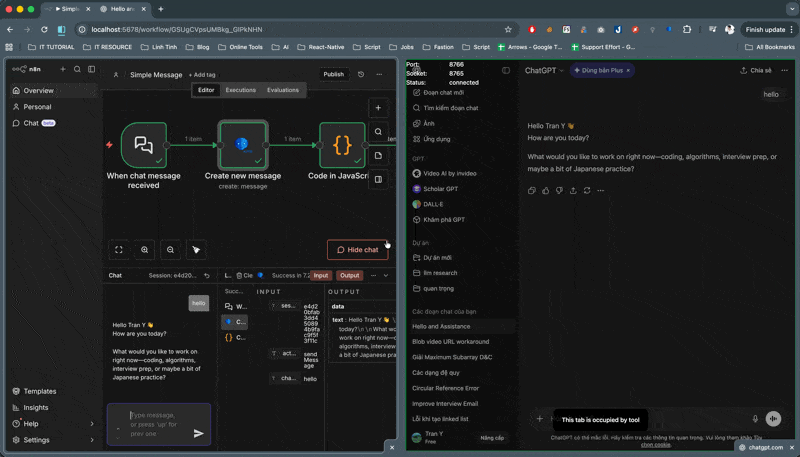

# GPT Inner Call (Browcall)

<p align="center">
  
  
  
  
  
  
  
  
  
</p>

GPT Inner Call is a monorepo project designed to bridge the gap between AI chat interfaces (like ChatGPT and Perplexity) and automated workflows. It provides a way to "call" these AI models internally by automating their web interfaces through a dedicated browser extension.


<p align="center">
  
</p>

## 🚀 Key Components

The project is organized as a monorepo using [Nx](https://nx.dev/):

### 🧩 Apps
- **[Browcall Extension](./apps/extension)**: A browser extension (Manifest V3) that injects logic into AI chat platforms (ChatGPT, Perplexity) to facilitate automated interactions.
- **[GPT Auto API](./apps/gpt-auto-api)**: A Node.js backend server that exposes an OpenAI-compatible `/v1/chat/completions` endpoint. It communicates with the browser extension to execute requests and retrieve responses.

### 📦 Packages
- **[n8n-nodes-browcall-gate](https://github.com/gys-dev/n8n-nodes-browcall-gate)**: Custom n8n nodes to integrate Browcall directly into your automation workflows.
- **[Interfaces](./packages/interfaces)**: Shared TypeScript definitions and interfaces used across the monorepo.

## 🛠 Tech Stack

- **Monorepo Management**: [Nx](https://nx.dev/)
- **Backend**: Node.js, Express, WebSocket (`ws`)
- **Frontend/Extension**: React, TypeScript, Vite
- **Integration**: n8n

## 🎬 Getting Started

### Prerequisites

- Node.js (v18+)
- Yarn or npm
- Google Chrome or Chromium-based browser (for the extension)

### Installation

1.  **Clone the repository:**
    ```bash
    git clone https://github.com/your-repo/gpt-inner-call.git
    cd gpt-inner-call
    ```

2.  **Install dependencies:**
    ```bash
    npm install
    # or
    yarn install
    ```

### Development

#### Running the API
To start the backend API in development mode:
```bash
npm run serve
```
The server will run at `http://localhost:8766`.

#### Building the Extension
To build the browser extension:
```bash
npm run build-extension-react
```
The build artifacts will be in `dist/apps/extension`. You can load this directory as an "Unpacked Extension" in Chrome.

#### Working with n8n Nodes
To build and integrate the n8n nodes:
```bash
npm run add-n8n-node
```

## 📖 API Documentation

The `gpt-auto-api` follows the OpenAI API specification.

### Chat Completions
- **Endpoint**: `POST /v1/chat/completions`
- **Description**: Forwards the chat request to the active browser session via the extension.

## 🤝 Contributing

1. Follow the [Knowns Guidelines](./AGENTS.md).
2. Ensure linting passes: `npm run lint`.
3. Test your changes: `npm run test`.

## 📄 License

This project is licensed under the MIT License.
