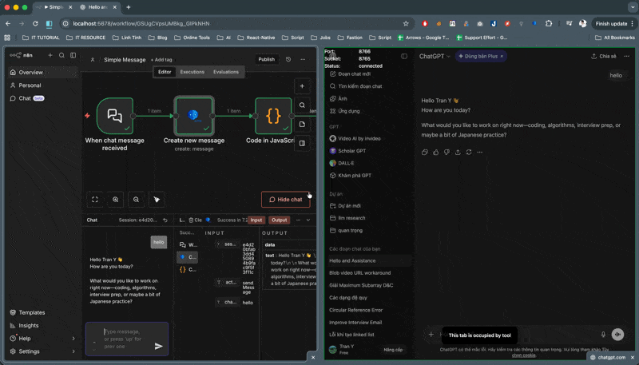

# GPT Inner Call (Browcall)

<p align="center">
  
  
  
  
  
  
  
  
  
</p>

GPT Inner Call is a monorepo project designed to bridge the gap between AI chat interfaces (like ChatGPT and Perplexity), automated workflows, and local Model Context Protocol (MCP) servers.

<p align="center">
  
</p>

---

## 🚀 Key Components

The project is organized as a monorepo using [Nx](https://nx.dev/):

### 🧩 Apps
- **[Browcall Extension](./apps/extension)**: A browser extension (Manifest V3) that injects logic into AI chat platforms (ChatGPT, Perplexity) to facilitate automated interactions.
- **[GPT Auto API](./apps/gpt-auto-api)**: A Node.js backend server that exposes an OpenAI-compatible `/v1/chat/completions` endpoint. It communicates with the browser extension to execute requests and retrieve responses.
- **[MCP Gateway](./apps/mcp-gateway)**: Remote MCP proxy and routing server that exposes an MCP endpoint (`/mcp`) for GPT/clients and accepts WebSocket connections from Local MCP Bridges.
- **[Local MCP Bridge](./apps/local-mcp-bridge)**: Local Node.js application running on the user's machine. It connects to local MCP servers via stdio (e.g., filesystem tools) and establishes an outbound WebSocket connection to the MCP Gateway.

### 📦 Packages
- **[n8n-nodes-browcall-gate](https://github.com/gys-dev/n8n-nodes-browcall-gate)**: Custom n8n nodes to integrate Browcall directly into your automation workflows.
- **[Interfaces](./packages/interfaces)**: Shared TypeScript definitions and interfaces used across the monorepo.

---

## ⚡ MCP Architecture Flow

```text
GPT / Client
     │
     │ HTTP POST / GET (JSON-RPC 2.0 / MCP Endpoint: http://localhost:8767/mcp)
     ▼
MCP Gateway (apps/mcp-gateway)
     │
     │ WebSocket Connection (ws://localhost:8768)
     ▼
Local MCP Bridge (apps/local-mcp-bridge)
     │
     │ Stdio / Child Process (JSON-RPC 2.0)
     ▼
Local MCP Server (e.g., @modelcontextprotocol/server-filesystem)
```

---

## 🛠 Tech Stack

- **Monorepo Management**: [Nx](https://nx.dev/)
- **Backend**: Node.js, Express, WebSocket (`ws`)
- **Frontend/Extension**: React, TypeScript, Vite
- **Integration**: n8n, Model Context Protocol (MCP)

---

## 🎬 Getting Started

### Prerequisites

- Node.js (v18+)
- Yarn or npm
- Google Chrome or Chromium-based browser (for the extension)

### Installation

1. **Clone the repository:**
   ```bash
   git clone https://github.com/gys-dev/browcall-gate.git
   cd browcall-gate
   ```

2. **Install dependencies:**
   ```bash
   yarn install
   # or
   npm install
   ```

---

## 🏃 Running & Development

### 1. GPT Auto API & Extension
- **Start API server**:
  ```bash
  yarn serve
  ```
  Runs at `http://localhost:8766`.

- **Build Extension**:
  ```bash
  yarn build-extension-react
  ```
  Artifacts located in `dist/apps/extension`. Load as an unpacked extension in Chrome.

### 2. MCP Gateway & Local MCP Bridge
- **Start MCP Gateway**:
  ```bash
  yarn serve:gateway
  ```
  Starts HTTP server at `http://localhost:8767` and WebSocket server at `ws://localhost:8768`.

- **Start Local MCP Bridge**:
  ```bash
  yarn serve:bridge
  ```
  Connects to `ws://localhost:8768` and initializes configured local MCP servers (e.g., filesystem MCP).

- **Build Gateway & Bridge**:
  ```bash
  yarn build:gateway
  yarn build:bridge
  ```

---

## ⚙️ Local MCP Bridge Configuration

Create an `mcp-config.json` file in the root directory (see [`mcp-config.sample.json`](./mcp-config.sample.json)):

```json
{
  "gatewayUrl": "ws://localhost:8768",
  "bridgeId": "mac-local-bridge",
  "clientName": "Local Mac MCP Bridge",
  "mcpServers": {
    "filesystem": {
      "command": "npx",
      "args": [
        "-y",
        "@modelcontextprotocol/server-filesystem",
        "/Users/me/projects"
      ]
    }
  }
}
```

---

## 📖 API Documentation

### OpenAI-Compatible Chat
- **Endpoint**: `POST /v1/chat/completions` (Port `8766`)
- **Description**: Forwards chat completions requests to active browser extension sessions.

### MCP Gateway
- **Endpoint**: `POST /mcp` (Port `8767`)
- **Description**: Forwards JSON-RPC 2.0 MCP requests (`tools/list`, `tools/call`, `initialize`, `ping`) to connected Local MCP Bridges.
- **Health Check**: `GET /health`
- **Connected Bridges & Tools**: `GET /bridges`

---

## 🤝 Contributing

1. Follow the [Knowns Guidelines](./AGENTS.md).
2. Ensure linting passes: `npm run lint`.
3. Test your changes: `npm run test`.

---

## 📄 License

This project is licensed under the MIT License.
